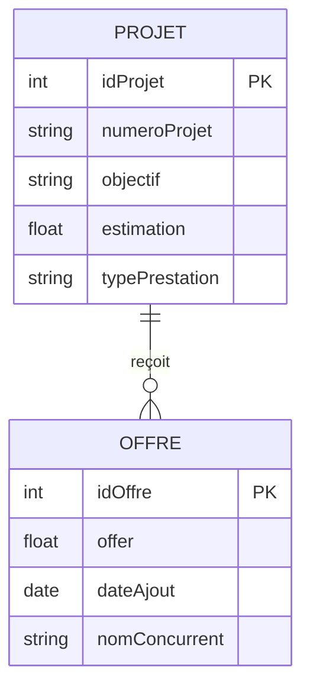

# Application Prix de Référence

Application web d'évaluation des offres financières dans les appels d'offres : elle détecte les offres excessives ou anormalement basses, calcule automatiquement le **prix de référence** et classe les offres des concurrents.

Projet réalisé lors d'un stage d'initiation à l'**Agence Régionale d'Exécution des Projets de l'Oriental (AREPO)**, du 05/08/2025 au 05/09/2025.

## Fonctionnalités

- **Saisie d'un projet** : numéro, objet, estimation et nature de la prestation (Travaux ou Autres)
- **Ajout des concurrents** : nom du concurrent et montant de son offre financière
- **Calcul automatique** :
  - détection des offres excessives et anormalement basses
  - calcul du prix de référence
  - classement des offres et sélection de l'offre la plus proche du prix de référence
- **Enregistrement** du projet et des offres en base de données
- **Recherche** d'un projet par son numéro, puis recalcul des résultats
- **Liste des projets** avec modification et suppression
- **Rapport PDF** imprimable (projet, offres, résultats et classement) pour la transparence et l'archivage

## Règles de calcul

**Prix de référence** : moyenne de l'estimation du maître d'ouvrage et de la moyenne des offres retenues (hors offres excessives et anormalement basses).

```
P = (E + (somme des offres retenues / nombre d'offres retenues)) / 2
```

- `P` : prix de référence
- `E` : estimation du coût des prestations établie par le maître d'ouvrage

**Offre excessive** : supérieure de plus de 20 % à l'estimation (travaux, fournitures et services autres que les études).

**Offre anormalement basse** : inférieure de plus de 20 % à l'estimation pour les travaux, et de plus de 25 % pour les fournitures et services autres que les études.

### Exemple (données fictives)

Estimation `E` = 1 000 000 DH, nature : Travaux.

| Concurrent | Offre (DH) | Écart / estimation | Statut |
|---|---|---|---|
| S1 | 1 050 000 | +5,00 % | Retenue |
| S2 | 1 120 000 | +12,00 % | Retenue |
| S3 | 1 500 000 | +50,00 % | Excessive |

- Moyenne des offres retenues : (1 050 000 + 1 120 000) / 2 = 1 085 000 DH
- Prix de référence : (1 000 000 + 1 085 000) / 2 = **1 042 500 DH**
- Classement par proximité du prix de référence : 1. S1, 2. S2

## Base de données

Deux tables principales, avec une relation « un-à-plusieurs » : un projet peut avoir plusieurs offres, et chaque offre est liée à un seul projet.



## Technologies

| Rôle | Technologie |
|---|---|
| Logique métier côté serveur | PHP |
| Base de données | MySQL |
| Structure et design de l'interface | HTML, CSS |
| Interactions dynamiques (recherche, couleurs des tableaux) | JavaScript |
| Environnement de développement | Visual Studio Code |
| Serveur local de test | WAMP |

## Installation

> Adaptez les noms entre chevrons à votre dépôt.

1. Installez [WAMP](https://www.wampserver.com/) (Apache, MySQL, PHP) et démarrez les services.
2. Clonez le dépôt dans le dossier `www` de WAMP :
   ```bash
   cd C:\wamp64\www
   git clone https://github.com/hanane-aissaoui/PrixDeR-f-renceV2.git
   ```
3. Dans phpMyAdmin, créez une base de données `<nom_de_la_base>` et importez le script SQL `<fichier_sql>`.
4. Vérifiez les paramètres de connexion à la base (hôte, utilisateur, mot de passe, nom de la base) dans `<fichier_de_connexion>.php`.
5. Ouvrez `http://localhost/PrixDeR-f-renceV2/` dans votre navigateur.


## Auteure

**Hanane Aissaoui** — étudiante ingénieure en Génie Informatique, ENSA Oujda

[GitHub](https://github.com/hanane-aissaoui) · [LinkedIn](https://www.linkedin.com/in/hanane-aissaoui-26600b21b) · [Portfolio](https://portfolio-aissaoui-hanane.netlify.app/)
